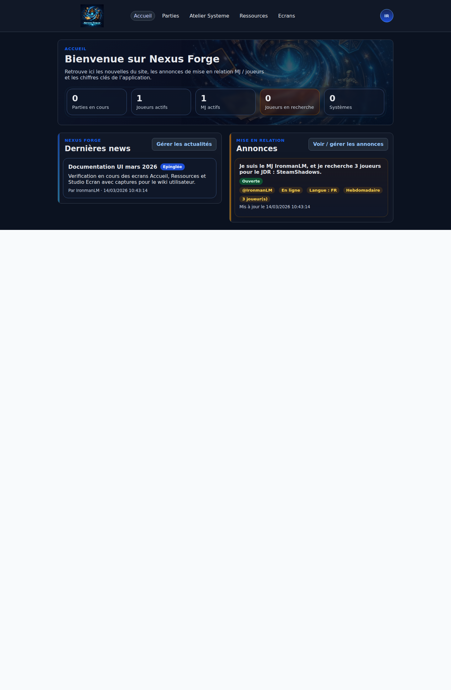

# Accueil connecte

## Verification visuelle - 2026-03-14

Cette page a ete reverifiee visuellement dans l application avec un compte admin/MJ local.

Perimetre de verification :

- hero d accueil
- cartes de statistiques
- bloc news
- bloc annonces
- navigation principale

Capture de reference :

La page `Accueil` devient l entree par defaut d un utilisateur connecte.

## Objectif

Donner en un seul ecran :

- les news publiees par les admins
- les annonces de mise en relation MJ / joueurs
- les statistiques globales de la plateforme

L accueil est volontairement en lecture seule :

- consultation des news
- consultation des annonces ouvertes
- statistiques globales

Les actions d edition ont ete deplacees :

- les news dans `Admin contenu`
- les annonces dans la page `Annonces`

## News admin

- visibles par tous les comptes connectes
- creees uniquement par les admins
- supportent :
  - titre
  - contenu
  - epinglage
- le contenu supporte maintenant un sous-ensemble Markdown compatible avec Discord :
  - titres `#`
  - listes `-`
  - gras `**...**`
  - italique `*...*`
  - souligne `__...__`
  - barre `~~...~~`
  - code inline `` `...` ``
  - liens `[label](https://...)`
- le meme texte de news peut donc servir :
  - au rendu web
  - au bot Discord
- l auteur affiche publiquement son pseudo, pas son nom complet

## Annonces

Le systeme d annonces est volontairement structure.

Types :

- `player_looking_for_game`
- `gm_looking_for_players`

Champs principaux :

- systeme cible
- langue
- format (`online`, `onsite`, `hybrid`)
- nombre de joueurs recherches pour un MJ
- jours de disponibilite
- creneaux horaires
- periodicite

La phrase principale est generee automatiquement par le backend.

L accueil n affiche qu un apercu :

- les 5 dernieres annonces actives
- version compacte
- lien vers la page `Annonces` pour filtrer, publier et gerer ses annonces

Fonctionnement social ajoute :

- bouton `Contacter` sur les annonces des autres utilisateurs
- ouverture directe de la messagerie privee hors partie
- les annonces des utilisateurs ignores sont masquees automatiquement
- le pseudo de l auteur est affiche a la place du nom complet
- le pseudo d une annonce est cliquable pour ouvrir la messagerie

Exemples :

- `Je suis le joueur X, et je recherche une partie de JDR : SteamShadows.`
- `Je suis le MJ X, et je recherche 3 joueurs pour le JDR : SteamShadows.`

## Statistiques

Les cartes de stats affichent :

- parties en cours
- joueurs actifs
- MJ actifs
- joueurs en recherche de partie
- nombre total de systemes

## Navigation

- un utilisateur connecte arrive maintenant sur `/home`
- la navigation principale affiche `Accueil`

## Rendu actuellement observe

Le rendu actuel confirme une page en deux temps :

- un bandeau hero `Bienvenue sur Nexus Forge`
- une rangee de 5 cartes statistiques
- une colonne `Dernieres news`
- une colonne `Annonces`

Points verifies dans l interface :

- les news epinglees remontent bien en tete ;
- les annonces affichent un resume compact avec badges de statut et de contexte ;
- la navigation principale expose `Accueil`, `Parties`, `Mes fichiers`, `Studio Ecrans` et `Studio système`.

Note :

- la capture de reference a ete prise avec un compte admin ; le bouton `Gerer les actualites` visible sur cette capture correspond donc a ce contexte.
