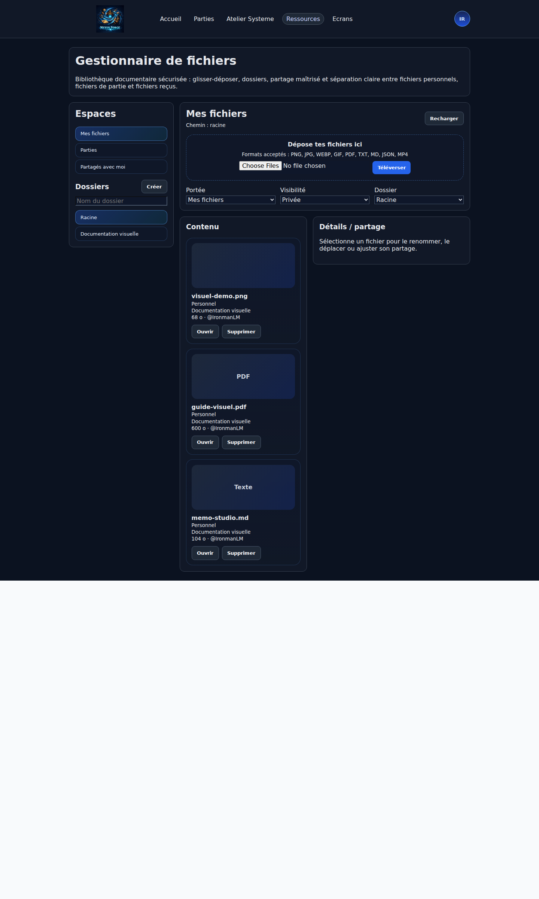

# Mes fichiers

## Verification visuelle - 2026-03-14

Cette page a ete reverifiee visuellement hors zone `Partie`.

Perimetre de verification :

- espace `Mes fichiers`
- liste des espaces visibles
- arborescence de dossiers
- zone de depot
- liste de contenu
- panneau `Details / partage`

Capture de reference :

La page `Mes fichiers` introduit une bibliotheque documentaire structuree, securisee et partageable.

## Espaces visibles

L utilisateur retrouve trois espaces :

- `Mes fichiers` : fichiers personnels et dossiers personnels.
- `Parties` : fichiers relies a une partie a laquelle il participe encore.
- `Partages avec moi` : fichiers recus hors partie ou visibles dans une partie.

## Types autorises

### Images
- PNG
- JPG / JPEG
- WEBP
- GIF

### Documents
- PDF
- TXT
- MD
- JSON

### Video
- MP4

## Types refuses

- SVG
- HTML
- ZIP
- executables
- fichiers Office
- WEBM / MOV / AVI

## Securite

Le backend ne se contente pas de l extension.

A chaque upload, Nexus Forge verifie :

- le MIME annonce,
- la signature du contenu,
- la coherence extension / MIME,
- la taille,
- le nom nettoye.

Les fichiers sont renomes cote serveur et toujours servis via une route authentifiee.

Pour les images, le serveur prepare aussi des derives optimises des l ajout du fichier :

- une miniature compacte pour les listes et grilles ;
- un apercu intermediaire pour les overlays et previsualisations rapides.

Ces derives restent servis via des routes authentifiees, mais avec un cache navigateur prive et durable.

## Dossiers

La bibliotheque fonctionne avec des dossiers logiques.

### Partie
Pour une partie, Nexus Forge maintient des dossiers de base :

- `Commun`
- `MJ uniquement`
- un dossier nominatif par participant

## Partage

### Personnel
Un fichier personnel peut etre :

- prive,
- partage a des utilisateurs cibles,
- public.

### Partie
Un fichier de partie peut etre partage uniquement dans la meme partie.

Audiences disponibles :

- `Commun`
- `MJ uniquement`
- `Joueur(s) cible(s)`
- `Prive`

Le repartage en partie est autorise par defaut, mais reste limite aux membres actuels de cette meme partie.

Si un utilisateur quitte la partie, il perd l acces aux fichiers de cette partie.

## UX actuelle

La page `Mes fichiers` propose :

- glisser-deposer,
- televersement multi-fichiers,
- creation de dossiers,
- previsualisation integree des images, PDF, videos MP4 et fichiers texte,
- previsualisation grand format en fenetre modale,
- vue detaillee d un fichier,
- changement de dossier,
- ajustement du partage,
- ouverture securisee des fichiers.

Le rendu actuellement observe confirme aussi une organisation en 4 zones :

- colonne `Espaces`
- colonne `Dossiers`
- colonne centrale `Contenu`
- panneau droit `Details / partage`

## Integration dans l application

Le gestionnaire de fichiers alimente deja :

- l avatar utilisateur,
- le widget `documents`,
- le widget `pdf_viewer`,
- le widget `media_viewer`,
- un selecteur de ressources unifie reutilisable dans le profil, le studio ecran et les champs image,
- les selecteurs d images dans le studio systeme,
- les selecteurs de ressources dans le studio ecran.

## Widget `documents` de partie

Dans une partie, le widget `documents` permet aussi :

- de previsualiser directement un document selectionne ;
- d ajuster l audience d un document de partie ;
- de cibler des joueurs precis ;
- d autoriser ou interdire le repartage en partie.

Le partage reste strictement limite aux membres actuels de la partie.

## Perimetre de cette passe de verification

La navigation et le rendu des espaces suivants sont bien visibles dans l interface :

- `Mes fichiers`
- `Parties`
- `Partages avec moi`

Cette page est maintenant coherente avec le menu actuel `Mes fichiers`.

## Correctifs mars 2026
- La file des fichiers en attente est maintenant affichee clairement dans la zone d upload.
- Le mode Apercu du studio ecran affiche desormais les apercus PDF/media quand une ressource est selectionnee.
- La lecture des fichiers avant upload a ete fiabilisee pour les imports multiples.

- Les actions Ouvrir de la bibliotheque et du widget documents utilisent maintenant une ouverture authentifiee.
- Les images uploadees generent maintenant une miniature et un apercu cote serveur pour accelerer l affichage dans les widgets et overlays.
- Le runtime joueur precharge aussi les ressources de session et reutilise un cache frontend partage au lieu de recreer un chargement complet a chaque widget.
