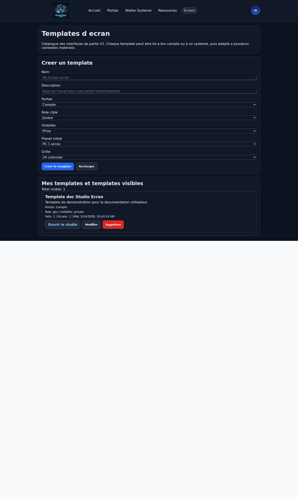
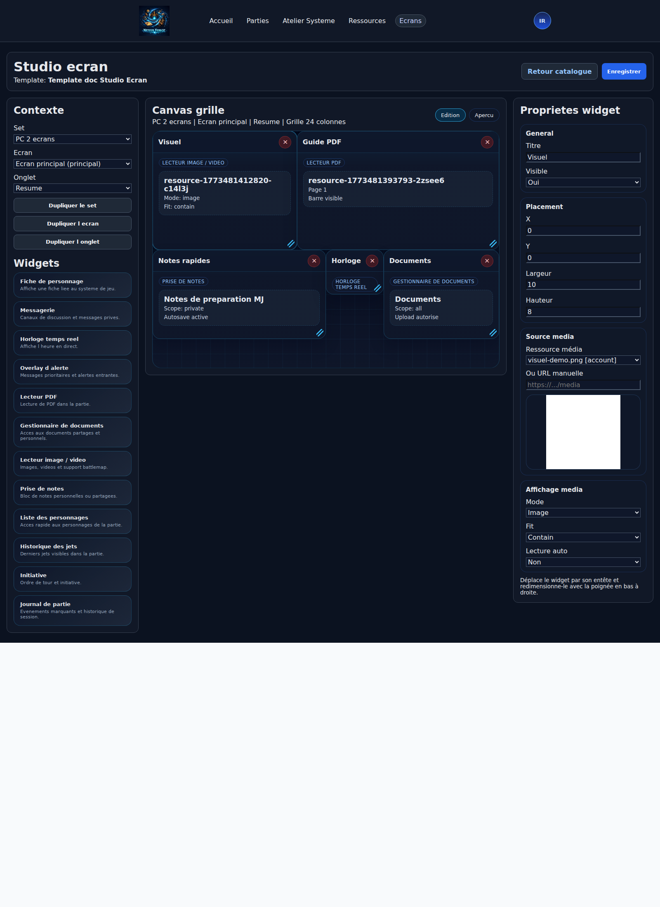

# Studio Ecrans

## Verification visuelle - 2026-03-14

Le catalogue `Studio Ecrans` et le `Studio Ecrans` ont ete reverifies visuellement dans l application, hors runtime de `Partie`.

Perimetre de verification :

- page catalogue des templates
- formulaire de creation
- liste des templates visibles
- ouverture du studio
- layout du studio
- palette de widgets
- canvas grille
- panneau de proprietes

Captures de reference :

### Catalogue



### Studio



## Objectif

Le Studio Ecrans sert a configurer les ecrans de jeu utilises pendant une partie, pour les joueurs comme pour les MJs.

Il est distinct du Studio système :

- le Studio système construit les fiches et vues d'un systeme de jeu ;
- le Studio Ecrans organise les widgets visibles pendant une partie.

Le Studio Ecrans fonctionne comme un bureau modulaire :

- activation de widgets ;
- placement sur une grille ;
- redimensionnement ;
- plusieurs ecrans ;
- detachement possible sur plusieurs moniteurs ;
- groupes de widgets accessibles par onglets sur un meme ecran.

## Principes valides

- pas de layout base sur `tableau / ligne / colonne` ;
- on travaille avec des widgets sur une grille d'accroche ;
- un template peut etre lie a un compte ou a un systeme ;
- si un utilisateur modifie un template lie a un systeme, cela cree un fork lie a son compte ;
- un MJ peut proposer un template de base a ses joueurs ;
- un joueur peut cloner ce template et le personnaliser ;
- un template cible un role : `player`, `gm` ou `both`.

## Hierarchie

Le Studio Ecrans repose sur quatre niveaux.

### 1. Template

Un template represente une configuration d'interface re-utilisable.

Proprietes minimales :

- `id`
- `name`
- `description`
- `scopeType`: `account` ou `system`
- `scopeRefId`
- `roleTarget`: `player`, `gm`, `both`
- `visibility`: `private`, `public`, `friends` (reserve pour plus tard)
- `isFavorite`
- `sourceTemplateId` (si fork)
- `createdBy`
- `updatedAt`

### 2. Set

Un template contient un ou plusieurs sets adaptes a un contexte materiel.

Exemples :

- `PC 1 ecran`
- `PC 2 ecrans`
- `PC 3 ecrans`
- `Tablette`
- `Telephone mobile`

Proprietes minimales :

- `id`
- `name`
- `devicePreset`
- `screenFormatPreset`
- `aspectRatio`
- `orientation`
- `referenceWidth`
- `referenceHeight`
- `gridColumns`: `12`, `24`, `36`, `48`
- `zoom`
- `screens`

Le `devicePreset` continue d indiquer le contexte materiel global :

- `PC 1 ecran`
- `PC 2 ecrans`
- `PC 3 ecrans`
- `Tablette`
- `Telephone mobile`

Le format d ecran est maintenant decrit separement pour le design du set :

- ratio : `16:9`, `16:10`, `4:3`, `21:9`, etc.
- orientation : `paysage` ou `portrait`
- resolution de reference : par exemple `1920x1080`

Cela sert de base de conception et de lecture dans le Studio Ecrans, sans changer le fonctionnement des widgets.

### 3. Ecran

Un set contient un ou plusieurs ecrans.

Un ecran peut :

- etre affiche dans la fenetre principale ;
- etre detache dans une autre fenetre ;
- contenir plusieurs groupes de widgets sous forme d'onglets.

Proprietes minimales :

- `id`
- `name`
- `mode`: `main` ou `detached`
- `tabGroups`
- `order`

### 4. Groupe d'onglet

Un ecran peut afficher plusieurs groupes de widgets sous forme d'onglets.

Exemples :

- onglet `Resume`
- onglet `Fiche`
- onglet `Initiative`

Proprietes minimales :

- `id`
- `name`
- `widgets`
- `isDefault`

### 5. Widget

Un widget est un module activable et configurable.

Proprietes minimales :

- `id`
- `type`
- `title`
- `layout`
- `config`
- `permissions`
- `dataSource`
- `isVisible`

Exemple de layout :

```json
{
  "x": 0,
  "y": 0,
  "w": 8,
  "h": 10,
  "minW": 2,
  "minH": 2
}
```

## Grille

Le Studio Ecrans utilise une grille d accroche.

Valeurs de densite prevues :

- `12`
- `24`
- `36`
- `48`

Regles :

- snap a la grille ;
- drag pour deplacer ;
- resize pour redimensionner ;
- pas de placement libre au pixel ;
- pas de superposition libre, sauf widgets overlay ;
- zoom du canvas autorise.

## Studio en place

Le premier Studio Ecrans utilisable est maintenant disponible dans l application.

Acces :

- `Studio Ecrans`
- ouvrir un template
- `Ouvrir le studio`

Fonctions deja disponibles :

- selection du `set` a editer ;
- selection de l `ecran` ;
- selection du groupe d `onglet` ;
- detachement du panneau gauche `Contexte` ;
- detachement du panneau droit `Proprietes widget` ;
- creation simple d un `set` ;
- suppression simple d un `set` ;
- creation simple d un `ecran` ;
- suppression simple d un `ecran` ;
- duplication du `set` actif ;
- duplication de l `ecran` actif ;
- duplication de l `onglet` actif ;
- palette de widgets ;
- ajout d un widget dans l onglet actif ;
- canvas sur grille ;
- mode `Edition` ;
- mode `Apercu` pour voir le rendu canvas sans quitter le studio ;
- deplacement d un widget ;
- redimensionnement simple ;
- edition des proprietes de base :
  - titre
  - bandeau titre visible ou masque
  - visibilite
  - x
  - y
  - largeur
- hauteur

## Cibles runtime

Le runtime peut ouvrir un contenu dans un autre widget du set actif.

Cas en place :

- `Gestionnaire de documents` vers `Overlay cible d ouverture`
- `Liste des personnages` vers `Fiche de personnage`

Regles actuelles :

- un widget `Fiche de personnage` peut recevoir `Ouvrir dans` tant qu il n est pas verrouille sur `Personnage explicite`
- un widget `Overlay cible d ouverture` peut recevoir `Ouvrir dans` depuis les documents
- le widget `Controle overlay cible` pilote ensuite l overlay associe
- sauvegarde du template.

Le rendu actuellement observe confirme aussi la structure suivante :

- panneau gauche `Contexte`
- actions de creation / suppression / duplication pour set, ecran et onglet
- palette des widgets
- zone centrale `Canvas grille`
- bascule `Edition` / `Apercu`
- panneau droit `Proprietes widget`
- les panneaux gauche et droit peuvent etre detaches en fenetres secondaires pour liberer le canvas central
- leur etat `detache / reintegre` est memorise localement sur le navigateur
- leur taille est aussi memorisee localement
- le widget `Liste des personnages` s appuie maintenant sur les vraies fiches de partie
- il peut filtrer `PJ`, `PNJ` et `Monstres`
- il expose aussi un bouton `Ouvrir la fiche` pour chaque personnage visible

Le catalogue `Studio Ecrans` expose actuellement :

- une liste `Mes templates`
- un bloc `Creer un template`
- les champs `Nom`, `Description`, `Portee`, `Role cible`, `Visibilite`, `Preset initial`, `Grille`
- les actions `Ouvrir le studio`, `Modifier`, `Supprimer`

Fonctions de confort ajoutees :

- selection guidee des ressources pour `pdf_viewer` ;
- selection guidee des ressources pour `media_viewer` ;
- selecteur de ressources unifie reutilisable dans plusieurs modules de l application ;
- selection guidee des vues systeme pour `character_sheet` quand le template ecran est lie a un systeme.
- ajout d un couple runtime `Overlay cible d ouverture` / `Controle overlay cible` ;
- le widget `Liste des personnages` peut maintenant envoyer une fiche vers un widget `Fiche de personnage` configure en `Cible runtime` ;
- le widget `Gestionnaire de documents` peut maintenant envoyer une ressource vers un `Overlay cible d ouverture`.

Limites du premier lot :

- pas encore de collisions intelligentes ;
- pas encore de zoom utilisateur du canvas ;
- pas encore de duplication de widget.

## Runtime de partie

Cette section n a pas ete reverifiee dans la presente passe, afin de respecter le gel temporaire de la zone `Partie`.

Le runtime de partie commence maintenant a utiliser les templates d ecran.

Depuis une partie :

- la partie peut proposer un template par defaut `MJ` ;
- la partie peut proposer un template par defaut `Joueur` ;
- si le systeme possede deja des templates d ecran, ils sont assignes automatiquement a la creation de la partie ;
- chaque utilisateur peut choisir son template actif pour son role ;
- un joueur peut cloner le template propose par le MJ dans ses templates personnels ;
- les ecrans secondaires du set s ouvrent dans d autres fenetres ;
- si plusieurs ecrans existent dans un set, le runtime reserve la fenetre courante a l ecran principal et ouvre les autres a part.

Le runtime actuel reprend :

- la grille du set choisi ;
- les onglets d un ecran ;
- le placement des widgets ;
- les proprietes metier minimales configurees dans le studio.

Widgets deja relies a de vraies donnees de partie :

- `character_sheet`
- `chat`
- `clock`
- `alert_overlay`
- `notes`
- `initiative`
- `documents`
- `pdf_viewer`
- `media_viewer`
- `character_list`
- `dice_history`
- `session_journal`

Le reste du runtime continue a utiliser un rendu simplifie, mais la chaine complete existe deja :

- template -> partie -> runtime.

## Widgets actifs valides

### Widgets de travail

- `character_sheet`
- `chat`
- `clock`
- `pdf_viewer`
- `documents`
- `media_viewer`
- `notes`
- `character_list`
- `dice_history`
- `initiative`
- `session_journal`

### Widgets overlay

- `alert_overlay`

## Widgets non retenus pour le moment

- `quests`

## Comportements valides

### Portee des templates

Un template peut etre :

- personnel (`account`) ;
- lie a un systeme (`system`).

Si un template systeme est modifie par un utilisateur :

- on cree un fork ;
- ce fork devient personnel.

### Droits

- le proprietaire du template peut le modifier ;
- un admin peut le modifier ;
- un MJ peut proposer un template de base a ses joueurs ;
- les joueurs peuvent cloner ce template pour eux-memes.

### Multi-ecrans

Les ecrans detaches et les onglets coexistent.

Exemple :

- ecran principal avec onglets `Resume`, `Fiche`, `Initiative` ;
- ecran secondaire detache avec `Documents` ou `Battlemap`.

## Presets de set valides

Les presets proposes par defaut sont :

- `PC 1 ecran`
- `PC 2 ecrans`
- `PC 3 ecrans`
- `Tablette`
- `Telephone mobile`

## Proposition d'architecture frontend

### Pages / modules

- page catalogue des templates ecran ;
- studio ecran ;
- runtime ecran de partie ;
- gestion des fenetres detachees.

### Composants techniques proposes

- `ScreenTemplatePage`
- `ScreenStudioPage`
- `ScreenRuntimePage`
- `WidgetGrid`
- `WidgetShell`
- `DetachedScreenWindow`

## Proposition de structure de donnees

```json
{
  "id": "layout_tpl_1",
  "name": "MJ double ecran",
  "description": "Template de base MJ pour bureau double ecran.",
  "scopeType": "system",
  "scopeRefId": "sys_1",
  "roleTarget": "gm",
  "visibility": "private",
  "isFavorite": true,
  "sourceTemplateId": null,
  "sets": [
    {
      "id": "set_desktop_2",
      "name": "PC 2 ecrans",
      "devicePreset": "desktop_2",
      "gridColumns": 24,
      "zoom": 1,
      "screens": [
        {
          "id": "screen_main",
          "name": "Ecran principal",
          "mode": "main",
          "tabGroups": [
            {
              "id": "tab_resume",
              "name": "Resume",
              "isDefault": true,
              "widgets": []
            }
          ]
        }
      ]
    }
  ]
}
```

## Contraintes actuelles

- pas de systeme d'amis au runtime ; la visibilite `friends` reste reservee ;
- pas de responsive automatique ambitieux ; on passe par des sets distincts ;
- pas d'Objectifs/Quetes dans le premier lot ;
- pas de superposition libre generalisee ;
- pas de moteur avance de docking.

## Etapes de dev recommandees

1. definir les types et le stockage des templates ecran ;
2. creer la page catalogue des templates ecran ;
3. creer le studio ecran avec grille, drag et resize ;
4. brancher les widgets ;
5. ajouter les ecrans detaches ;
6. permettre a un MJ de proposer un template de base a une partie ;
7. permettre au joueur de cloner ce template.

## Correctifs apercu
- Le mode Apercu du studio ecran utilise maintenant une vraie preview de ressource pour les widgets PDF et media quand une ressource est liee.
